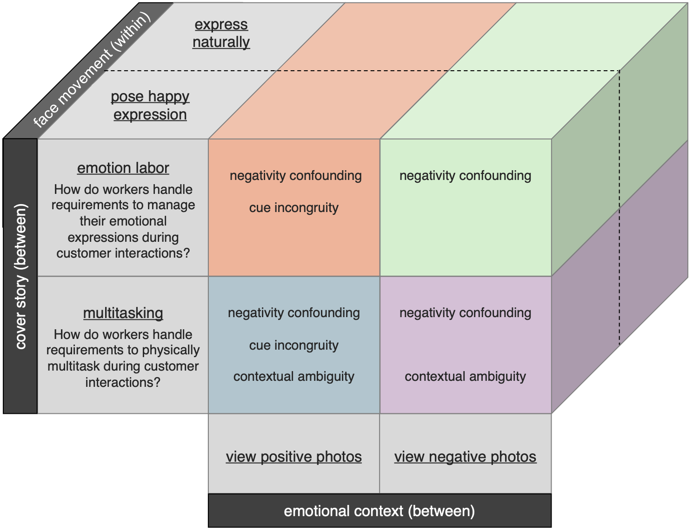

```{r setup, include = FALSE}
library("papaja")
r_refs("r-references.bib")
```

Researchers and lay people alike have long been interested in whether it's possible to "smile your way to happiness" [@coles2019meta; @nettle2005happiness; @folk2023systematic]. In addition to its allure as a positive psychology intervention, such an idea relates to fundamental questions about the nature of emotion. For over a century, emotion embodiment theorists have posited – often controversially – that peripheral nervous system activity causally shapes a variety of emotion-related processes [@cacioppo1992emotion; @damasio2013nature; @scherer2019emotion; @feldman2024neurobiology; @barrett2017theory; @tomkins1962affect; @wood2016fashioning; @james1948emotion; @james1894physical]. This includes not only mood, but also emotion recognition, the processing of emotional words and concepts, and decision making [@niedenthal2007embodying]. Research on posed smiles seems to support such theories. Indeed, the idea that posed smiles can increase feelings of happiness has recently been supported by a meta-analysis of nearly 50 years of research [@coles2019meta], a large-scale adversarial collaboration [@coles2022multi], and several studies designed to critically evaluate the role of demand and placebo effects [@coles2023fact].

The emotion embodiment literature provides both a theoretical and empirical rationale for suspecting that people can smile their way to happiness. However, such an idea is challenged by work in two other influential literatures: (1) the *emotion regulation* literature, which focused on strategies that people use to influence their emotional expressions and experiences, and (2) the *emotion labor* literature, which examines emotion regulation dynamics in the context of work.

For emotion regulation researchers, posed smiles are conceptually similar to the notion of *emotion suppression*. Relative to cognitive reappraisal, reviews suggest that the effect of emotion suppression on mood is inferior at best [@webb2012dealing] and ineffective or counterproductive at worst [@fernandes2021systematic]. Further, many researchers have posited that emotion suppression has regulatory costs, with negative implications for well-being [@dryman2018emotion; @hu2014relation; @yu2023habitual], social outcomes [@chervonsky2017suppression], and cognitive performance [@roche2018effects; @zhu2021arithmetic]. Researchers who study emotion labor tend to agree. For emotion labor researchers, posed smiles are conceptually similar to the notion of *surface acting* performed in the context of a job. In this research tradition, surface acting is often contrasted to deep acting: the use of strategies like cognitive reappraisal to bring one's emotions in line with work expectations [@grandey2017state]. Previous reviews suggest that surface acting is not only associated with lower employee well-being, but also more negative job attitudes and performance outcomes [@hulsheger2011costs].

In summary, even without considering the full depth of the emotion regulation and labor literatures [but see @gross2015emotion; @zapf2021emotion], one thing is clear: the emotion embodiment perspective on smiling and feelings of happiness is not uncontested. This raises questions about the validity of thinking not only in work on emotion embodiment, but also emotion regulation and labor.

## Potential explanations for discrepant viewpoints

When considering perspectives outside the emotion embodiment program of research, it seems that smiles may sometimes be a source of joy and other times a source of misery. In the present work, we provide pre-registered tests of three potential explanations for this discrepancy.

### Negativity confounding hypothesis

One possibility is that mood-boosting effects of smiling are outweighed by mood-dampening effects of situations that often call for the management of emotion expressions.

Negativity confounding could explain discrepancies observed in correlational vs. experimental work on the management of facial movements. Consistent with emotion regulation and labor theories, several reviews of correlational evidence have concluded that the management of emotion expressions is associated with a host of negative outcomes [@hulsheger2011costs; @fernandes2021systematic; @boemo2022relations; @visted2018emotion]. However, the correlational nature of such observations raises concerns about confounding: the same situations that require the management of emotional expressions tend to have negative effects on emotion [@zapf2021emotion].

@zapf2021emotion argued that "the negative effects of surface acting on well-being are, to an unknown but certainly considerable degree, due to the stressful situation that triggers negative emotions requiring surface acting rather than to its regulatory costs" (p. 165). When controlling for such negativity confounding via experiments [@frank2023experimentology], a different pattern emerges. Consistent with emotion embodiment theories, two meta-analyses of experimental data indicate that suppressing emotional expressions generally reduces self-reports of the elicited emotion [@coles2019meta; @webb2012dealing]. To address negativity confounding, we conduct our investigation in an experimental context that allows us to control for its \[typically confounded\] emotional tone via precise manipulation.

### Cue incongruency hypothesis

A second possibility is that the mood-boosting effects of smiling do not generalize to contexts with incongruent emotional tones. Self-perception theories of emotion often posit that emotional experience is shaped by both internal and external cues [@duclos2001deliberate; @laird1974self; @laird2007emotional]. Emotion embodiment researchers tend to study contexts that are relatively congruent with the posed expressions (i.e., positive or neutral contexts), whereas emotion regulation and labor researchers tend to study contexts that are relatively incongruent with the posed expressions (e.g., negative customer interactions). When emotion embodiment researchers extend into negative/stressful contexts, they often fail to find evidence that posed smiles impact subjective mood [@kraft2012grin; @pressman2021smile; @luu2025power].

"Posed smiles increase joy – but are often studied in contexts that bring people misery."

"Posed smiles don't increase joy in the real world – just in relatively artificial research contexts created by experimental psychologists."

"Posed smiles can make you feel better in positive – but not negative – contexts"

### External invalidity hypothesis

A third possibility is that posed smiles only boost mood in the relatively artificial research contexts created by experimental psychologists. In other words, perhaps research on the facial feedback hypothesis is externally invalid. Self-perception theories of emotion also tend to emphasize peoples’ inferences about the meaning of internal emotional cues [@duclos2001deliberate; @laird1974self; @laird2007emotional]. Emotion embodiment researchers often have participants pose expressions in contexts intentionally designed to draw attention away from a potential relationship to emotional experience [e.g., @larsen1992facilitating; @strack1988inhibiting]. This helps minimize the potential impact of demand characteristics and expectancies [@coles2023quantitative; @corneille2023sixty]. However, it is possible that observed effects do not generalize to situations where people are more saliently aware that their facial movements are not representative of their true emotional state – e.g., in customer service scenarios that require people to feign emotional displays. To evaluate this possibility, the present work manipulates the explanation participants are provided for their request to pose smiles.

# Methodology

The present study features a 2 (Face movement: pose smile, express naturally) x 2 (Cover story: emotion labor, multitasking) x 2 (Emotional Context: positive, negative) design, with the first factor manipulated within-subjects (Figure \@ref(fig:design)). As a Registered Report, our pre-registered design, sampling plan, and analysis strategy was finalized before data collection commenced (https://osf.io/2suyx/?view_only=8052e16be97d4bee8f93a6fa67b02893).

```{r design, fig.cap = "Overview of the 2 (Face movement) x 2 (Cover story) x 2 (Emotional Context) experimental design. Colored boxes indicate the simple effect of posed smiles in the associated condition, along with the set of hypotheses that would predict the simple effect."}

```

## Participants and procedures

N = 3,500 participants will be recruited from Prolific: an online platform where people complete studies in exchange for payment. (See *Power simulation* for more information.) To control for translation-related sources of heterogeneity, the study will be exclusively run in English. Workers on the platform will be eligible to participate if they (a) have completed at least 5 studies on the platform and (b) have at least 90% of their study submissions accepted. This helps ensure that the quality of participants’ responses have been vetted by other researchers. In order to record participants' facial movements, they will also be informed that they must have a functioning webcam to be eligible for compensation. Because the study cover story will be manipulated, the experiment will will be advertised with a relatively ambiguous title: “A study on task demands”. Participants will told that they'll receive \$4 for completing the 20 minute study (\$12 / hr), with the potential to receive an additional \$4 bonus once we verify they complete all study tasks correctly. Bonus payment is offered to both encourage and control for the perceived importance of accurate responding across conditions manipulated between-subjects. In actuality, however, all participants will recieve the full \$8 at the end of the study.

Participants will complete the online study experiment via a browser-based experiment platform, Gorilla Experiment Builder [@anwyl2020gorilla]. After consenting, participants will confirm their webcam functionality by recording and watching the playback of a short video through the survey program. Next, participants will be randomly assigned to one of two cover stories. For the *ambiguous cover story* designed to be more similar to a typical facial feedback study, participants will be told that “we are examining how physical multi-tasking influences mathematical speed and accuracy.” For the *emotion labor cover story* designed to be more similar to a real world expression management context, participants will be told “we are examining how managing emotional expressions in the context of work (e.g., customer service) influences mathematical speed and accuracy”.

During the study, participants will complete four trials, all which are a conceptual replication of a large multi-lab adversarial test of facial feedback effects [@coles2022multi]. The first and last trials will be filler trials designed to corroborate the cover stories. In the first trial, participants will be asked to “place your left hand behind your head and blink your eyes once per second for 5 seconds”. In the last trial, participants will be asked to “Tap your left leg with your right-hand index finger once per second for 5 seconds.”

More critically, during the second and third trials, participants will be instructed to either pose a smile or express themselves normally for 5 seconds. More specifically, participants will be shown four images of actors trained to display prototypical expressions of happiness. These images were originally compiled from the Extended Cohn-Kanade Dataset [@lucey2010extended] and arranged in a single 2x2 image matrix so that participants have multiple examples of a prototypical expression of happiness [@coles2022multi]. Participants will be asked to either (a) adopt the pictured expression, or (b) not attempt to control their facial movements. Importantly, having participants view the same image matrix in both trials helps eliminate the potentially confounding effect that images of smiling people may have on emotional experience. Limiting the trial to 5 seconds helps reduce fatigue and ensure a similar duration as authentic emotional expressions [@ekman1982felt].

During the two critical trials, participants will encounter stimuli validated to elicit either a positive or negative mood. For participants who receive an ambiguous cover story, these stimuli will be images used in past research [@coles2022multi, @coles2020face]. For positive stimuli, participants will view pictures of flower, kittens, and rainbows, arranged in a single 1 x 3 row. In negative stimuli, they will view pictures of inconsiderately parked vehicles, acts of theft, and animal maltreatment (arranged in a single row). For participants who receive an emotion labor cover story, the stimuli will be customer feedback validated in pilot research. More specifically, participants will encounter a recording of a customer compliment (positive) or complaint (negative) about workers on the Prolific platform – i.e., the platform where the participants themselves work. Stimuli will be delivered visually (images) or auditorily (customer feedbcak) while participants complete the facial movement trials. While doing so, participants’ facial movements will be recorded through their webcam, which is automatically toggled through the survey program.

Immediately after each trial, participants will complete a modified Discrete Emotions Questionnaire [@harmon2016discrete], wherein they report the extent to which they experienced a variety of emotions during the preceding trial (1 = Not at all, 7 = An extreme amount). Following @coles2023fact, and modified the questionnaire in three manners. First, to shorten the measure, we limited ourselves to the happiness (three averaged items: happiness, satisfaction, and enjoyment), anger (irritation, aggravation, and annoyance), and fear (alarmed, scared, fear) subscales. Second, we limited ourselves to only three items from each subscale. Third, we replaced the original anger items (anger, rage, mad, and pissed off) with more moderate options (e.g., irritation).

The key outcome-of-interest is self-reported happiness. However, to explore potential effects on two other outcomes frequently discussed in the emotion regulation and labor literatures: well-being and burnout. To do so, participants will complete measures of satisfaction with life [e.g., "In most ways my life is close to my ideal"; 1 = Strongly Disagree, 7 = Strongly Agree; @diener1985satisfaction] and burnout [e.g., "To what extent to you feel hopeless; 1 = Not at all, 7 = An extreme amount; @malach2005burnout]. Afterwards , participants will complete a simple filler math problem (e.g., 2+ 2 = ?). This is done to both (a) corroborate the cover story and (b) evaluate whether participants are paying attention. Participants will be removed in sensitivity analyses if they do not answer the math questions correctly.

After completing all four trials, participants will self-report their age, gender [Male, Female, Nonbinary; @garbarski2025improving], and ethnicity [@omb2024revisions]. As a quality check, they will then be asked to "Please describe any issues you had during the study that may compromise the quality of the data you provided". Afterwards, participants will be asked two questions about the purpose of the study. First, participants will simply be asked what they believe was the purpose of this study. Second, they will be informed that "There are details about the purpose of this study that we have not yet told you about" and asked to guess what those details might be. Participants will be removed in sensitivity analyses if two independent coders agree that they (a) correctly identified the true purpose of the study, or (b) were too distracted to provide accurate responses. At the conclusion of the study, participants will be fully debriefed and payed out the full bonus (regardless of actual performance).

After the study is complete, we will identify participants who did not successfully complete the facial movement tasks. To do so, we will use a commercially available emotion expression recognition model, Hume AI. Like other emotion expression recognition models, Hume AI uses computer vision to track facial landmarks (e.g., lips) associated with emotion expression (e.g., smiling) for each video frame. These features are passed through a deep neural network to predict observer ratings of emotion [@brooks2024deep]. To be clear, although efficient and scalable, such models can fail to accurately infer peoples' subjective emotional experiences in complex and/or real-world scenarios [@cross2023critique]. However, in relatively simple experimental contexts similar to ours, emotion expression recognition models have been successfully deployed to identify non-smiling participants[@coles2022multi; @coles2020face]. In the present work, Hume AI will provide moment-to-moment estimates (ranging from 0 - 1) of smiling-related activity using Facial Action Coding System classifications [@ekman1978facial]. We will focus on Action Unit 12 in particular, which is associated with pulling the corner of the lips back towards the ear. We will subsequently run three increasingly stringent sensitivity analyses, wherein participants are excluded if they do not exhibit a .1, .3, or .5 change in Action 12 activity.

## Hypotheses

The negativity confounding, cue incongruency, and contextual ambiguity hypotheses make different predictions about when simple effects of Face Movement will appear (Figure \@ref(fig:design)).

The negativity confounding hypothesis suggests that posed smiles consistently increase happiness – and that correlational evidence to the contrary is due to confounding with negative situations that require emotion regulation/labor. Thus, in the present study, this hypothesis predicts (a) a main effect of Face Movement, and (b) no higher-order interactions involving Cover Story and Emotional Context.

The cue incongruity hypothesis suggests that posed smiles only increase happiness when external cues (e.g., images) are congruent with the internal cues (e.g., posed smiles). In the present study, this hypothesis predicts (a) a two-way interaction between Face Movement and Emotional Context, (b) a significant simple effect of Face Movement when images are positive, and (c) a non-significant simple effect of Face Movement when images are negative.

The contextual ambiguity hypothesis suggests that posed smiles only increase happiness when participants do not have an emotion-related explanation for the behavior (e.g., that the expression is feigned to appear happy to customers). Thus, in the present study, this hypothesis predicts (a) a two-way interaction between Face Movement and Cover Story, (b) a significant simple effect of Face Movement when the cover story describes multi-tasking, and (c) a non-significant simple effect of Face Movement with the cover story describes emotion labor.

## Primary analyses

Due to the nested nature of the data (observations nested within participants), we will fit a multi-level model using the *lme4 R* package [@bates205fitting]. Happiness reports will be modeled with (a) Face Movement, Cover Story, and Emotional Context entered as effect-coded factors, (b) all higher-order interactions, and (c) random intercepts for participants.

Using the *lmerTest R* package [@lmerTest], we will test the significance of main effects and higher-order interactions via ANOVA-style tests with Satterthwaite degrees of freedom. The negativity confounding hypothesis predicts a main effect of Face Movement, but the cue incongruity and contextual ambiguity hypotheses predict an interaction with Cover Story and Emotional Context respectively. Regardless of the significance of these interactions, we will estimate the simple effects of Face Movement within each crossed level of Cover Story and Emotional Context using the *emmeans R* package [@lenth2024emmeans]. The cue incongruity hypothesis predicts a significant simple effect of Face Movement in the positive Emotional Context, but not the negative Emotional Context. The contextual ambiguity hypothesis predicts a significant simple effect of Face Movement in the ambiguous Cover Story, but not the emotion labor Cover Story.

Analyses will focus on the statistical significance of modeled higher-order interactions and simple effects. However, Bayes factors will also be computed using the *BayesFactor R* package using medium Cauchy priors (*r* scale, 1/2) on the alternative hypotheses and the default Markov chain Monte Carlo settings [@morey2024bayes]. Because excluding participants on the basis of manipulation and attention checks can introduce posttreatment estimation bias [@mathur2025attention; @rohrer2024causal], all data will be included in initial confirmatory analyses. However, additional sensitivity analyses will be performed excluding participants who (a) did not complete the entire study, (b) failed at least one attention check, (c) correctly identified the purpose of the study, (d) indicated that they were distracted, and (e) did not exhibit more Action Unit 6 and 12 activation, on average, during the smile posing trial.

## Exploratory analyses

Regardless of if/when posed smiles increase happiness, it is possible that there are regulatory costs for general burnout and subjective well-being. We do not believe that a reliatively brief manipulation of Face Movement provides strong tests of whether these regulatory costs exists. Thus, we considered these questions *exploratory*, and we will evaluate them by refitting the same model described above for self-reported burnout and subjective well-being.

## Power simulation

Power analysis was performed via Monte Carlo simulation, wherein across multiple iterations (1) data are simulated from multi-level models configured according to hypothesized patterns, (2) pre-registered models are fit on simulated data, and (3) power is estimated as the proportion of iterations wherein pre-registered models were statistically significant [@arend2019statistical]. We first simulated the effect of Face Movement in the condition where the negativity confounding, cue incongruity, and contextual ambiguity hypotheses all predict a positive effect on feelings of happiness: an ambiguous (cover story = multitasking) and positive (images = positive) context. To simulate the effect and data structure, we used a conceptually identical subset of data from the largest adversarial demonstration of facial feedback effects [@coles2022multi]. Next, we created three simulations to represent three potential pattern of results.

Our first simulation focused on the negativity confounding hypothesis, which predicts a homogenous positive effect of Face Movement in all tested conditions (raw d = 0.50 on a 7-point scale). Our second simulation focused on a test of the most strict interpretation of the cue incongruity and contextual ambiguity hypothesis: a positive simple effect of Face Movement (d = 0.50) in two conditions and a null simple effect in two other conditions (d = 0.00). In other words, this simulation examines a scenario where emotion labor and/or negative cues completely eliminate the positive effect of Face Movement on feelings of happiness. Our third simulation focused on a less strict interpretation of these hypotheses: a scenario where emotion labor and/or negative cues diminish the effect of Face Movement on feelings of happiness to half it’s previously-documented size [@coles2022multi].

For each simulation, we estimated power using a Monte Carlo simulation with 1000 iterations. The main and interaction effects were tested using the *lme4* package [@bates205fitting], and the simple effects were tested using the *emmeans* package [@lenth2024emmeans]. The significance level was set to α = 0.05, and our simulation focused on achieving 95% power for tests of all hypothesized interactions and simple effects.

Results from the third power simulation (our most conservative simulation) indicated that 3400 participants would provide over 95% power for all hypothesized interactions and simple effects. We thus aim to recruit *N* = 3,500 participants

\newpage

# References

::: {#refs custom-style="Bibliography"}
:::